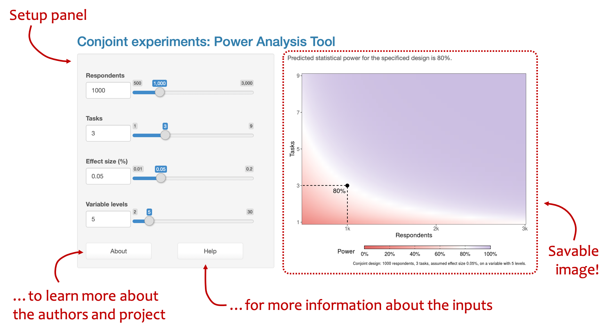
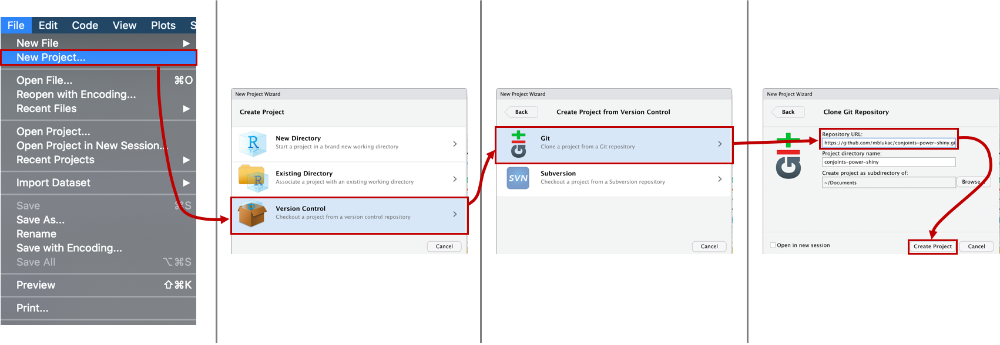

# Conjoint Experiments: Power Analysis Tool


Are you running a conjoint experiment and struggling with design considerations? Unsure about how many respondents, trials or levels for a variable are needed? This Shiny App for calculating power of a conjoint experimental design is here to help you.

We are currently working on a paper that would offer more in-depth explanation. You can find some of the results of our work and descriptions in this [short Twitter thread](https://twitter.com/mblukac/status/1314220796529655809). A full research paper will follow shortly!

## How to use the App?
&nbsp;&nbsp;&nbsp;


## Setup

The Shiny app calculates power of a simple conjoint experiment design based on the [Hainmueller et al (2014)](https://doi.org/10.1093/pan/mpt024) framework. At the present stage, it has four inputs:

  * __Respondents__: Number of respondents that are going to answer the survey.
  * __Tasks__: Number of tasks each respondent will receive (sometimes called trials or selection tasks).
  * __Effect size__:  The expected effect size in %. This is the expected Average Marginal Component Effect (see <a href=\"https://doi.org/10.1093/pan/mpt024\">Hainmueller et al. 2014</a>)
  * __Variable levels__: Number of levels of your categorical variable — i.e. gender (male vs. female) has two categories. Use the number of levels of the attribute with the highest number of levels to obtain a power of the experimental design as a whole (lowest threashold).

In the next iterations, we will add also Type M and S error rates (see [Gelman and Carlin 2014](http://www.stat.columbia.edu/~gelman/research/published/retropower_final.pdf)). We would also like to add more features, such as calculating power of an interaction between attributes and subgroup analysis.

--------
  
## How to run it locally in RStudio?

The app is running on shinyapps.io, which provides only limited free hours of computer time for running Shiny apps. We are paying the standard subscription for this app, which should cover the run-time of majority of requests. However, if you see the page down or you struggle loading it in your browser, we offer an alternative you can run locally. Just follow these steps:

### 1. Prepare your computer

First make sure that you have the most up-to-date version of [R](https://www.r-project.org) and [RStudio](https://rstudio.com/products/rstudio/download/) downloaded. Make sure you have Git installed on your local machine (a short guide [here](https://git-scm.com/book/en/v2/Getting-Started-Installing-Git)). It is good practice to restart your computer after installing new software to make sure it works properly.

Open RStudio and install the necessary libraries by running the following command:

```{r}
install.packages(c("shiny", "ggplot2", "shinythemes", "shinyWidgets", "shinydashboard", "ggrepel"))
```

### 2. Get the App

In the second step, you will download the App locally to your computer. Copy the following link:

```{r}
https://github.com/mblukac/conjoints-power-shiny.git
```

Open RStudio and follow these steps. In the last window, paste the copied URL ☝️ to `Repository URL`.

&nbsp;&nbsp;&nbsp;


When you hit `Create Project`, RStudio will connect to GitHub and get the newest version of the App to your local computer.

### 3. Run the App

Go to console and run the app script by typing (or copy-pasting) the following:

```{r}
source("app.R")
```

This will make sure that all the libraries are properly loaded and ready to run the App.

In the final step, run the follwing command in the console:

```{r}
runApp("app.R")
```

This will run the application locally on your computer. You can always re-run `runApp("app.R")`if you close the window with the App. If RStudio doesn't open the App for you after running `runApp("app.R")`, look to the console for the following lines:

```{r}
Listening on http://127.0.0.1:xxxx
```

Copy and paste the `http://127.0.0.1:xxxx` to your browser. This should open the App for you.

--------

Enjoy and please don't forget to let us know what you liked or disliked and to cite our work in your papers:

```{r}
Lukac, M. & Stefanelli, A. (2020). Conjoint Experiments: Power Analysis Tool. Retrieved from https://mblukac.shinyapps.io/conjoints-power-shiny/
```

